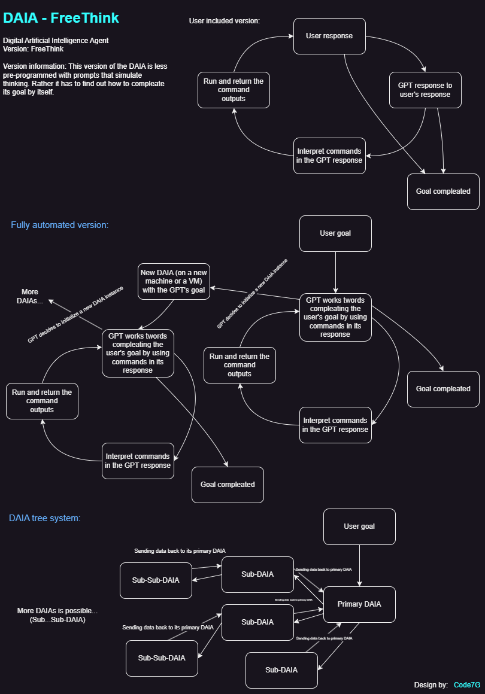
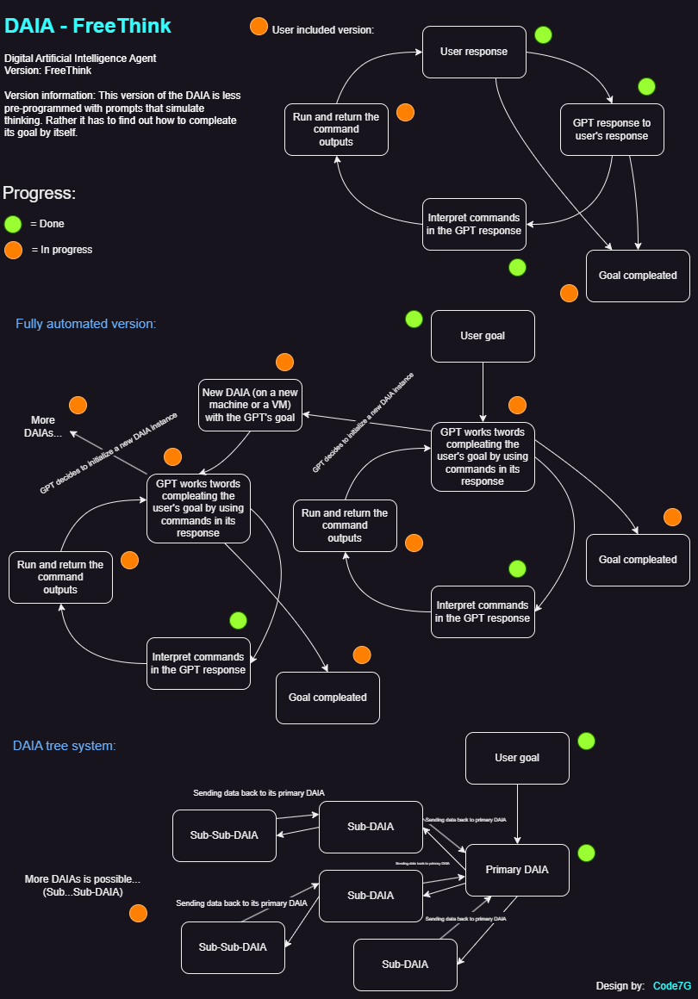

# Digital Artificial Intelligence Agent (V3) 👨‍💻🤖

DAIA is a powerful Digital Artificial Intelligence Agent that enables intelligent interactions with your PC to help you achieve your goals.

###### Project Incomplete

## Table of Contents 📜

1. [Introduction](#1-introduction-🚀)
2. [Overview](#2-overview-📖)
3. [Features](#3-features-🌟)
4. [Versions](#4-versions-✨️)
5. [Usage](#5-usage-🤝)
6. [Contribution](#6-contribution-🙌)
7. [License](#7-license-📄)

## 1. Introduction 🚀

DAIA is a cutting-edge visual AI agent designed to enhance your productivity by intelligently interacting with your computer (or other computers) and completing big goals. With DAIA, you can complete goals, automate tasks, gather information, and perform various operations seamlessly, just like you would do yourself.

## 2. Overview 📖

The main difference with the DAIA compared to other AI Agents is that it interacts with your computer through a vision system (DVAI(GPT-4V)) and task completion system allowing it to be capable of doing many more tasks and goals compared to other AI Agents that use the Terminal or command prompt for interaction with the computer.
Furthermore, the DAIA will be built with a built-in memory, self-evaluating and optimizing system from the start.

## 3. Features 🌟
(for both versions)

- **Intelligent Interaction**: DAIA can interact with your PC using natural language, making it easy to communicate your needs. (in progress)

- **Goal Completion**: Automate and complete goals (in progress)

- **Task Automation**: Automate repetitive tasks and processes, saving time and effort. (in progress)

- **Information Retrieval**: Get real-time information, answers, and data from the web. (in progress)

- **Multi-Platform Support**: DAIA is compatible with various operating systems and applications. (in progress)

- **Customization**: Tailor DAIA to your specific needs and preferences through custom scripts and plugins. (not done yet)

- **Memory**: Each action is saved into the memory, allowing you to start where you left off. (in progress)
    
- **Security**: Ensure your data and interactions are secure with robust encryption and privacy measures. (not done yet)

- **Endless Scalability**: DAIA can make multiple copies of itself and create its own network of DAIAs provided the computing power. (in progress)

- **Automation of Big Goals**: DAIA can automate big goals with its capability to make multiple versions of itself, therefore making the process faster. (in progress)

## 4. Versions ✨️

- ### DAIA-PreProgrammed
This version of DAIA is pre-programmed with a set of prompts and processes that it will follow in its programmed order. Therefore this version is much more complex.

Here is our current blueprint for the pre-programmed DAIA and its features:
.png)

- ### DAIA-FreeThink
This version of DAIA is much more free to complete the goals you give it in its own way, kind of like ChatGPT, but if it had vision and the ability to interact with your computer. Therefore it is much simpler in its design however, it can still scale if possible. (memory, optimization and a functional vision system coming soon)

Here is our current blueprint for the free think DAIA and its features:

## 5. Usage 🤝

1. Install the DAIA by running `git clone https://github.com/Envedity/DAIA.git` in your desired path, or by downloading and extracting the zip file.
2. Make a python 3.11 env using the `requirements.txt` file.
3. Run the DAIA.py file by typing `python DAIA.py` in the DAIA directory.
4. Choose a version of the DAIA you want to use:

- #### DAIA-PreProgrammed version:
1. Choose `DAIA_GPT4V-PreProgrammed` by typing `1` in the prompt.
2. Give it a goal.
3. Let it know if you agree with what it suggests for goal completion.
4. Sit back and let the DAIA complete your goal all by itself

- #### DAIA-FreeThink version (as of now):
1. Choose `DAIA_GPT4V-FreeThink` by typing `2` in the prompt.
2. Give it a goal, or other request you want it to do.
3. Wait for its response and respond, you can stop when you think your goal is completed.

## 6. Contribution 🙌

We welcome contributions from the DAIA community to help improve and expand the capabilities of our AI agent. It is still in its early development stage so there is a lot to be done and we urgently need your support in this effort. Here's how you can contribute:

- **Join Our Discord Server**: If you're a developer or someone who is interested in contributing, please join our Discord server The Envedity Network at: https://discord.gg/V4T6QFUw9c, there you can become a developer and will be able to directly contribute to the main DAIA repo with us, as well as share your feedback, suggestions, and bug reports with us and more.. Your insights are valuable in shaping the future of DAIA

Here is what we have already done from the DAIA blueprints:

PreProgrammed:
%20progress.png)

FreeThink:

- **Feedback**: Share your feedback, suggestions, and bug reports with us. You can do this by [opening an issue](https://github.com/Envedity/DAIA/issues) on our feedback repository or in our Discord server.

- **Share**: Share the DAIA project with others you know to spread the word (DAIA repo link: https://github.com/Envedity/DAIA)

- **Support (Sponsor the project)**: You can sponsor us through this e-mail: envedity@gmail.com or donate/support us at https://patreon.com/user?u=108155871&utm_medium=clipboard_copy&utm_source=copyLink&utm_campaign=creatorshare_creator&utm_content=join_link

We appreciate your support in making DAIA even better for all users! 🙏

Let's build the future of AGI Together!

## 7. License 📄

DAIA is under the GNU Version 3 license (https://fsf.org/).

For the most up-to-date information, visit [DAIA's official website](https://envedity.github.io/). 🌐🚀
